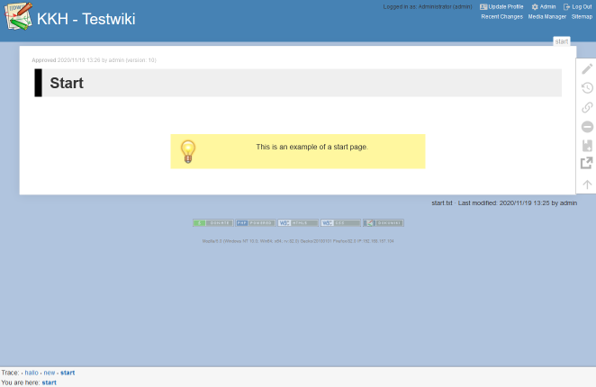
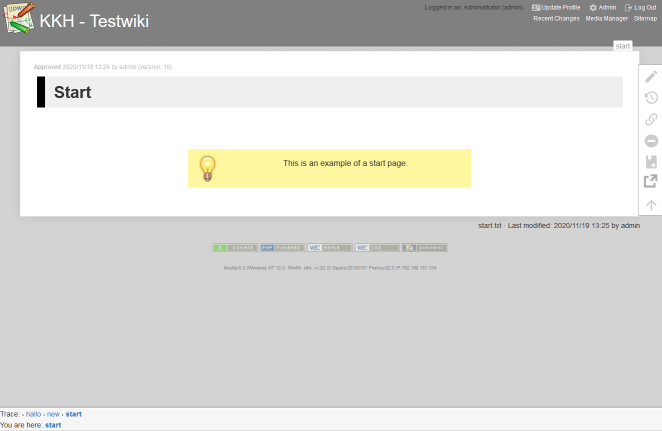

# DokuWiki: KKH Template

Template based on the standard Dokuwiki-Template

## Features

* Font-sizes increased
* Width increased
* H1-headers (in the content area) with modified style (color configurable)
* Animation when loading pages (configurable)
* Integration of the [addnewpage](https://www.dokuwiki.org/plugin:addnewpage)-Plugin
* Style-Modifications for the [Approve-Plugin](https://www.dokuwiki.org/plugin:approve)
* Style-Modifications for the [Button-Plugin](https://www.dokuwiki.org/plugin:button)
* Colors for header-area can be set
* Color (or optional: image) for page background can be set
* Configurable slider for an external link
* Content-Area can be set to transparent for the initial ``start``-Page
* added ``transparent`` as second tag for ``box`` for der [wrap](https://www.dokuwiki.org/plugin:wrap)-Plugin to be used on transparent start pages, e.g. ``<WRAP box transparent 500px>Some content</WRAP>``

## Compatibility

Tested with

* PHP **7.3**
* DokuWiki **Hogfather** (2020-07-29)
* [Addnewpage-Plugin](https://www.dokuwiki.org/plugin:addnewpage) / **2015-11-02**
* [Approve-Plugin](https://www.dokuwiki.org/plugin:approve) / **2020-09-21**

## Issues / Ideas

None at present

## License

This work is distributed unter the [GPL2-License](http://www.gnu.org/licenses/old-licenses/gpl-2.0.html) and ist based on the dokuwiki-templated contained in (bundled) with DokuWiki and was originally written by Annika Henke
